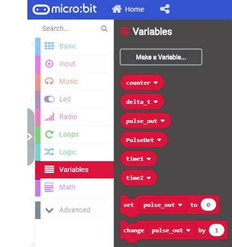
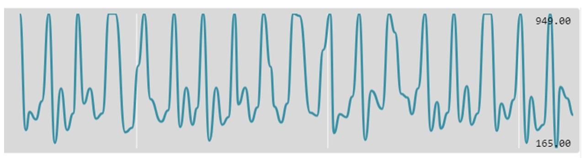
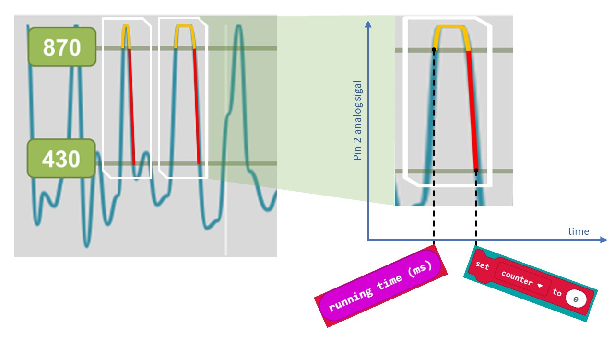
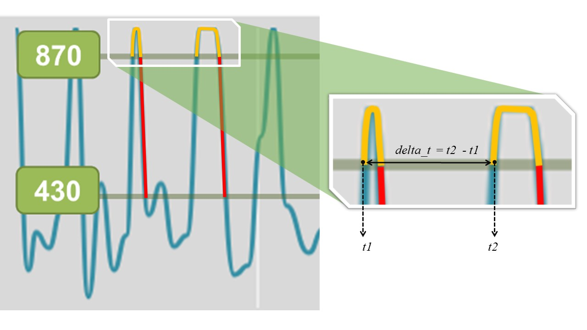

# Micro:bit & vital signs

### 1. About the project: "Heart rate monitoring and pulse measurement"
This project shows in practice how to use micro:bit to implement a pulse measurement device. In order to build the pulse monitor and the measurement device, I used the micro:bit board and an optical heart rate detector. (pulsosensor.com)

For today's DIY we will need:

1) One micro:bit chip - www.microbit.org 
1) One pulse sensor (Pulsesensor) - www.pulsesensor.com
1) Three jumper wires for tiles with a female ending or a one-sided ending with a hook.
1) One power supply with a micro-B USB plug (i.e. a power adapter used to charge multiple mobile phones)
1) Optionally, one adapter for micro:bit which makes it easier to connect the cables.

The optical detector (pulsosensor.com) can be attached to your finger. The device scans the fingertip with an intensive light source and monitors the amount of light that returns to the detector. The blood flowing through the blood vessels absorbs the light. Within the function of time, we can observe that at one moment more light returns to the detector and next time - less. In this way we can observe the course of heart rate. The detector has got 3 wires. Two of them are used for power supply and one of them is an analog output that displays an electrical signal, proportionally to the level of light in the detector. The analog output can be connected directly to the analog controllers' interfaces. I connected them to the micro:bit board, as shown in diagram 1.

***Diagram 1:** The connection of micro:bit board with the pulse sensor.*


Because micro:bit can share its power with peripheral devices, I connected it to the wires powering the optical detector. I used analogue-digital interface of micro:bit no. 2 to read the analog signal that represents the heart rate.

>Note: the detector (pulsosensor.com) is very sensitive to motion (as it generates distortion). It is also important to choose the place of measuring the pulse and the pressure while attaching the detector.

At the website: https://pulsosensor.com you will find the simplest micro:bit algorithm for reading the heart rate signal from the sensor. In this project I have shown the extended potential of the micro:bit circuit. I used a USB connection between micro:bit and a PC to present the pulse pathway. The micro:bit programming environment enables receiving data from the USB cable and presenting them in a console on a browser or a dedicated software in the form of numbers or graphs. It is also possible to save read values to CSV files for further analysis. In this case, in the graph presented in the console, you can observe the course of the measured pulse. The value of the pulse is presented on a LED display.

Figure 2.1 presents a block program, which I divided into 5 main blocks. The first one is performed when the application starts. The four remaining ones are the loops, which are executed in a parallel manner without any “pauses”. Figure 2.2 presents a list of block variables used in the program. Although the variables do not require any special form of declaration, it is good to consider their numbers and names beforehand. Figure 3 shows the same program in JavaScript.

>*Useful remark:<br/>
Programmers can quickly switch between a block programming view and a JavaScript view. Both modes can be combined. If you’re missing a block, it would be easier to get this feature into JavaScript. After switching to block programming mode, the added function or a line of code in JavaScript will be presented on a separate block, which will be included in the whole program sequentially.*

***Figure 2.1.** Block algorithm*


https://makecode.microbit.org/_iid8zbRi7Uq2

***Figure 2.2.** Variables used in a program.*



***Figure 3.** Source code in JavaScript.*

```js script
let time1 = 0
let delta_t = 0
let time2 = 0
let PulseDet = 0
let pulse_out = 0
let counter = 0
basic.showString("PULS__")


basic.forever(function () {
    basic.showNumber(pulse_out)
    basic.showIcon(IconNames.Heart)
})

basic.forever(function () {
    PulseDet = pins.analogReadPin(AnalogPin.P2)
})

basic.forever(function () {
    serial.writeValue("Pulse diagram", PulseDet)
})

basic.forever(function () {
    if (PulseDet > 870 && counter == 0) {
        time2 = input.runningTime()
        delta_t = time2 - time1
        time1 = time2
        counter = 1
        pulse_out = (60000 - 60000 % delta_t) / delta_t
    } else if (PulseDet <= 430 && counter == 1) {
        counter = 0
    }
})
```

### 3. Program’s description

Figure 4 shows a diagram of the analogue signal that is received from the sensor. The graph represents the course of the measured heart rate. The observed waveform is not as precise as shown on ECG monitors but it gives the possibility to observe and measure the pulse.

***Figure 4.** Analogue signal transmitted from the Pulsosensor which represents the pulse rate.*



The electrical signal on the analogue micro:bit output can reach a value between 0 and 3 V. The variable representing the read signal can achieve an overall value between 0 and 1023. The range of these values in our project can be read on the analog-digital interface no. P2. For the course of the pulse shown in Figure 4 there is a minimum and a maximum value of the recorded signal. This signal decreased to the minimum value of 165 and reached the maximum value of 949. The trial and error method (non-scientific) has defined for this program two decision-making levels of the signal received from the pulsometer (Figure 5):

***Figure 5.** Two decision-making levels defined for the pulse estimation algorithm.*


1. When the signal level from the pulse meter rises above the value of 870, the program saves the current time of this event, assuming that an impulse was detected. Since this moment the program will not search for the next signal increase above the level of 870 unless…

2. …the signal from the pulse meter drops below the level of 430. Then, the program will be waiting again until the signal level rises above 870 in order to record the time of next impulse and to calculate the time (delta) between the first detected impulse and the next one. The calculated delta will allow you to measure the pulse in the next step.

***Figure 6.** Impulse searching and the recording of the time when the impulse appears*



We can often observe some interference in the pulsometer’s signal. After the signal rises above the level of 870, it can go slightly below this level in short time and then rise above it again repeatedly. This type of signal disturbance would result in an error of the heart rate measurement with a value of even several hundred percents. Therefore, it is necessary to determine next decision threshold of 430. That’s the value below which the signal must fall before waiting for the next rate impulse begins. (Figure 6).

The algorithm of the precise heart rate calculation can be certainly more accurate. The way presented in the project was chosen as a compromise between the quality of the pulse measurement and the complexity of the algorithm, including the number of parameters and conditions in the program.

The above algorithm allows to detect impulses and calculate the time lapse between two consecutive impulses (Figure 7).

> ### delta_t = time2 — time1

The time lapse between impulses (delta_t) was calculated by subtracting “time1” from “time2”. The time saved in “time2” variable is the moment of the most recent impulse detection, and the time saved in “time1” variable is the moment of the previous impulse detection.

***Figure 7:** Calculation of the time lapse between impulses.*



After calculating the time lapse between impulses, it is possible to calculate the pulse, which is defined as the number of heartbeats per minute. The “Running time” function used in the block program records the system time to a variable. This time is recorded right at the moment when this function is being called. The time value is recorded in milliseconds. Therefore, the time lapse calculated in the program is also saved in thousandths of a second. For the correct calculation of the pulse rate, we divide 60 000 (one minute equals 60 seconds and 60 000 milliseconds) by the elapsed time or “delta_t”.

> *In Figure 3 that presents the block algorithm you can see how to calculate the pulse based on the passage of time. The variables in the block programming environment of micro:bit can only assume integer values. Therefore, the result of the calculation includes a correction for the remainder of the division.*
