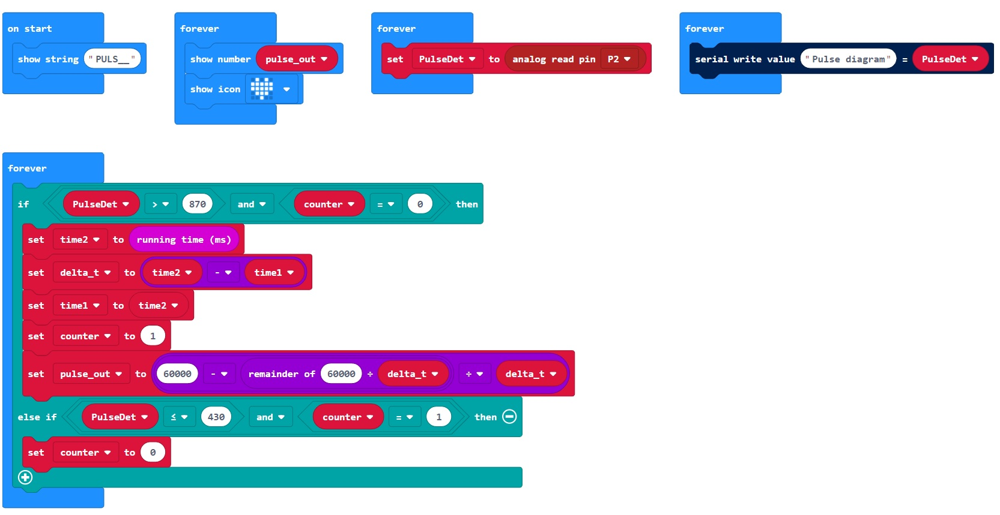

# Micro:bit & vital signs

### 1. About the project: "Heart rate monitoring and pulse measurement"
This project shows in practice how to use micro:bit to implement a pulse measurement device. In order to build the pulse monitor and the measurement device, I used the micro:bit board and an optical heart rate detector. (pulsosensor.com)

For today's DIY we will need:

1) One micro:bit chip - www.microbit.org 
1) One pulse sensor (Pulsesensor) - www.pulsesensor.com
1) Three jumper wires for tiles with a female ending or a one-sided ending with a hook.
1) One power supply with a micro-B USB plug (i.e. a power adapter used to charge multiple mobile phones)
1) Optionally, one adapter for micro:bit which makes it easier to connect the cables.

The optical detector (pulsosensor.com) can be attached to your finger. The device scans the fingertip with an intensive light source and monitors the amount of light that returns to the detector. The blood flowing through the blood vessels absorbs the light. Within the function of time, we can observe that at one moment more light returns to the detector and next time - less. In this way we can observe the course of heart rate. The detector has got 3 wires. Two of them are used for power supply and one of them is an analog output that displays an electrical signal, proportionally to the level of light in the detector. The analog output can be connected directly to the analog controllers' interfaces. I connected them to the micro:bit board, as shown in diagram 1.

***Diagram 1:** The connection of micro:bit board with the pulse sensor.*

Because micro:bit can share its power with peripheral devices, I connected it to the wires powering the optical detector. I used analogue-digital interface of micro:bit no. 2 to read the analog signal that represents the heart rate.

>Note: the detector (pulsosensor.com) is very sensitive to motion (as it generates distortion). It is also important to choose the place of measuring the pulse and the pressure while attaching the detector.

At the website: https://pulsosensor.com you will find the simplest micro:bit algorithm for reading the heart rate signal from the sensor. In this project I have shown the extended potential of the micro:bit circuit. I used a USB connection between micro:bit and a PC to present the pulse pathway. The micro:bit programming environment enables receiving data from the USB cable and presenting them in a console on a browser or a dedicated software in the form of numbers or graphs. It is also possible to save read values to CSV files for further analysis. In this case, in the graph presented in the console, you can observe the course of the measured pulse. The value of the pulse is presented on a LED display.

Figure 2.1 presents a block program, which I divided into 5 main blocks. The first one is performed when the application starts. The four remaining ones are the loops, which are executed in a parallel manner without any “pauses”. Figure 2.2 presents a list of block variables used in the program. Although the variables do not require any special form of declaration, it is good to consider their numbers and names beforehand. Figure 3 shows the same program in JavaScript.

>Useful remark:
Programmers can quickly switch between a block programming view and a JavaScript view. Both modes can be combined. If you’re missing a block, it would be easier to get this feature into JavaScript. After switching to block programming mode, the added function or a line of code in JavaScript will be presented on a separate block, which will be included in the whole program sequentially.

***Figure 2.1.** Block algorithm*

